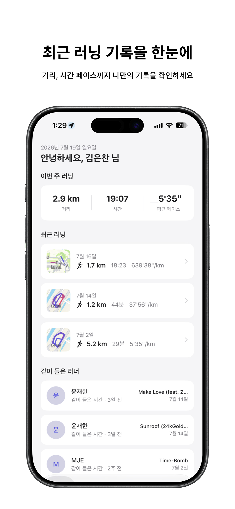
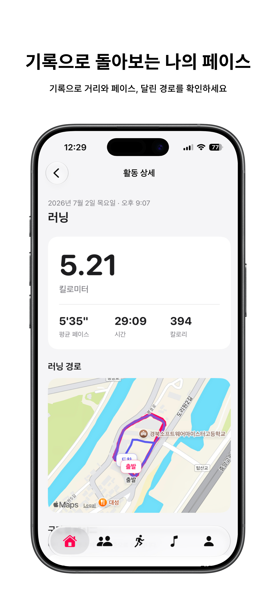
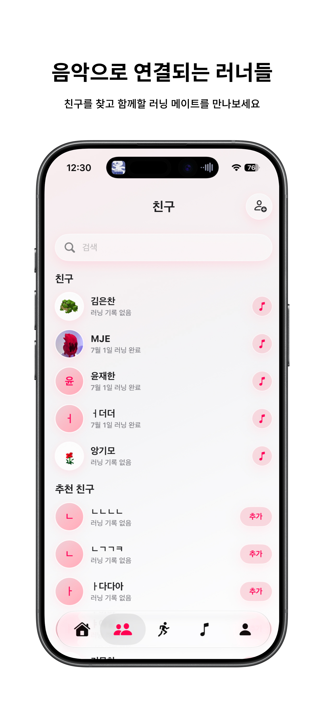
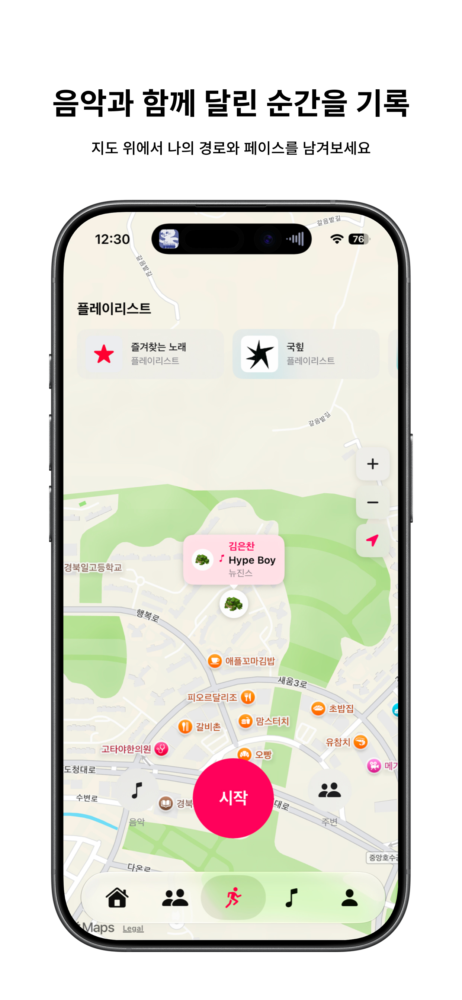
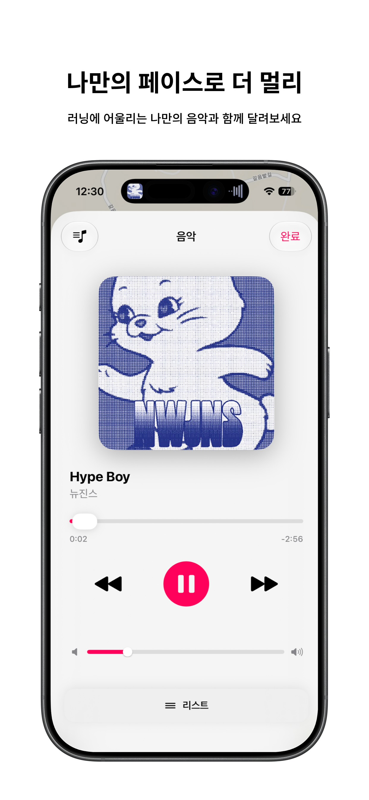
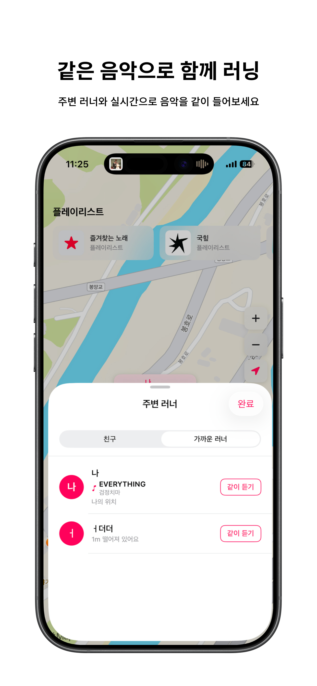
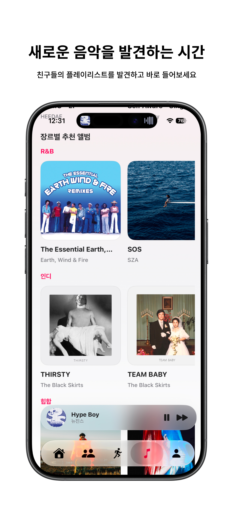
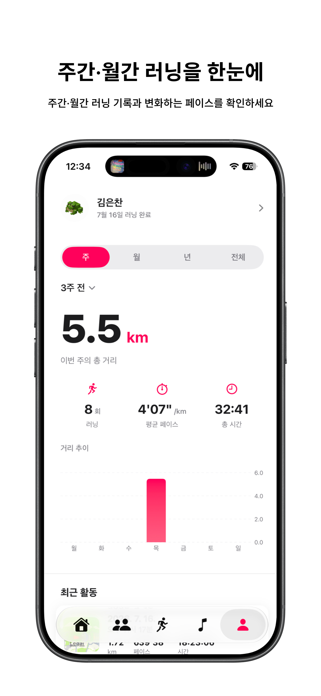

# Pacing - 음악으로 연결되는 러닝

<p align="center">
  
</p>

<p align="center">
  <strong>"같은 음악, 같은 페이스. 나만의 러닝을 기록하고 함께 달려보세요."</strong>
</p>

<p align="center">
  <a href="https://apps.apple.com/kr/app/pacing/id6784299290">
    
  </a>
</p>

---

## 스크린샷

<p align="center">
  
  
  
</p>
<p align="center">
  
  
  
</p>
<p align="center">
  
  
  
</p>

---

## 소개

**Pacing**은 음악과 함께 달리는 순간을 기록하고 공유하는 iOS 러닝 앱입니다.

GPS 경로와 페이스를 남기고, Apple Music으로 나에게 맞는 음악을 고르며, 친구와 주변 러너의 음악을 발견할 수 있습니다. 기록을 혼자 쌓는 데서 끝나지 않고, 같은 음악으로 서로의 러닝을 연결하는 경험을 지향합니다.

## 주요 기능

### 1. 위치 기반 러닝 기록

> 달린 경로와 페이스를 자동으로 남기고, 러닝이 끝난 뒤에도 한눈에 돌아보세요.

- Core Location 기반 실시간 거리·시간·페이스 계산
- 지도 위 러닝 경로와 시작 지점, 구간별 페이스 확인
- 백그라운드 위치 업데이트를 고려한 러닝 추적
- 러닝 종료 후 요약과 상세 활동 기록 저장

### 2. 내 페이스 분석

> 이번 주부터 전체 기록까지, 달라지는 나의 페이스를 직관적인 차트로 확인하세요.

- 주·월·연·전체 단위의 거리, 러닝 횟수, 평균 페이스, 총 시간 집계
- Swift Charts 기반 일자별 거리 추이 시각화
- 차트 막대를 선택하면 해당 날짜의 러닝 카드가 자연스럽게 표시
- 최근 활동 목록에서 개별 러닝 상세 화면으로 이동

### 3. Apple Music과 함께 달리기

> 러닝 분위기에 맞는 음악을 찾고, 앱 안에서 끊김 없이 재생하세요.

- Apple Music 권한 및 구독 상태 확인
- 내 보관함 플레이리스트와 최근 재생 앨범 탐색
- 장르·무드 기반 추천 앨범 및 플레이리스트 제공
- 재생 중인 곡의 앨범 아트워크와 재생 상태 표시

### 4. 음악으로 만나는 친구

> 친구가 최근에 들은 음악과 플레이리스트에서 다음 러닝의 사운드트랙을 발견하세요.

- 친구의 최근 러닝과 최근 재생 음악을 홈에서 확인
- 친구 프로필에서 러닝 기록과 최근 들은 노래 탐색
- 친구의 공유 플레이리스트 상세 확인 및 내 보관함에 저장
- 곡 정보에 맞는 Apple Music 아트워크 URL 보완 처리

### 5. 주변 러너와 같이 듣기

> 가까운 러너를 발견하고, 같은 트랙으로 함께 달려보세요.

- Realtime Database 기반 활성 러너 위치 브로드캐스트
- 지도에서 내 위치와 주변 러너를 구분해 표시
- 함께 듣기 요청·수락·거절과 세션 종료 흐름 제공
- 재생 위치와 재생 상태를 실시간 세션으로 동기화

### 6. 친구 관리와 프로필

> 함께 달릴 사람을 찾고, 나와 친구의 활동을 한곳에서 관리하세요.

- 닉네임 검색과 추천 친구, 친구 요청 보내기·수락·거절·취소
- 내 프로필 편집과 누적 거리·운동 시간·평균 페이스 확인
- 친구 프로필의 최근 러닝과 음악 활동 확인

### 7. 간편하고 안전한 시작

> 익숙한 계정으로 빠르게 시작하고, 필요한 권한은 사용 맥락에 맞게 요청합니다.

- 이메일, Sign in with Apple, Google, Kakao, Naver 로그인
- 온보딩에서 프로필·위치·Apple Music 권한을 단계적으로 안내
- Firebase Authentication으로 로그인 상태와 사용자 세션 관리

## 기술 스택

| 구분 | 기술 |
| --- | --- |
| UI | Swift, SwiftUI, Swift Charts |
| 아키텍처 | Feature-first MVVM, `@MainActor` 기반 화면 상태 관리 |
| 비동기 | Swift Concurrency (`async` / `await`) |
| 지도·위치 | MapKit, Core Location, 백그라운드 위치 업데이트 |
| 음악 | MusicKit, Apple Music API, `ApplicationMusicPlayer` |
| 데이터 | Firebase Authentication, Cloud Firestore, Realtime Database, Cloud Functions |
| 인증 | Sign in with Apple, Google Sign-In, Kakao SDK, Naver Third-Party Login |
| 의존성 | Swift Package Manager (Xcode 프로젝트) |

## 아키텍처

프로젝트는 기능 중심으로 화면을 나누고, 각 기능 안에서 **View와 ViewModel**을 분리합니다. 공통 플랫폼·데이터 접근 코드는 `Core`에 두어 화면이 Firebase, 위치, MusicKit 구현에 직접 의존하지 않도록 구성했습니다. 현재 규모에 맞춘 실용적인 Feature-first MVVM 구조입니다.

```text
SwiftUI View
    ↓ 사용자 입력 / 상태 표현
ViewModel
    ↓ 화면 상태 · 비즈니스 흐름 조합
Core Service
    ↓ 데이터·플랫폼 접근 캡슐화
Firebase / Apple Music / Core Location / MapKit
```

| 계층 | 책임 |
| --- | --- |
| `Features/*/View` | 화면 렌더링, 접근성·터치 이벤트 등 UI 표현 |
| `Features/*/ViewModel` | 화면 상태, 비동기 로딩, 사용자 액션 처리 |
| `Core/AppState` | 앱 전역 상태와 탭·세션 흐름 관리 |
| `Core/Firebase` | 사용자, 러닝, 친구, 최근 음악, 공유 플레이리스트의 영속·실시간 데이터 처리 |
| `Core/Location` | 권한 처리, 위치 추적, 경로 좌표 수집, 백그라운드 위치 동작 관리 |
| `Core/Music` | Apple Music 권한, 추천·보관함·아트워크 조회와 재생 처리 |
| `Models` | 러닝, 친구, 공유 플레이리스트 등 도메인 데이터 모델 |
| `DesignSystem` | 색상과 공통 로딩 UI 등 재사용 가능한 표현 요소 |

### 프로젝트 구조

```text
Pacing/
├── Core/
│   ├── AppState/             # 앱 전역 상태
│   ├── Auth/                 # 인증 상태와 소셜 로그인
│   ├── Date/                 # 날짜·기간 계산
│   ├── Firebase/             # Firestore / Realtime Database 서비스
│   ├── Location/             # 위치·경로 추적
│   └── Music/                # Apple Music 추천·재생·아트워크
├── DesignSystem/             # 공통 컬러와 UI 컴포넌트
├── Features/
│   ├── Auth/                 # 로그인·회원가입
│   ├── Onboarding/           # 프로필·권한 설정
│   ├── Home/                 # 러닝·친구 활동 홈
│   ├── Running/              # 러닝, 경로, 요약, 주변 러너
│   ├── Friends/              # 친구와 친구 프로필
│   ├── Share/                # 음악 추천·공유 플레이리스트
│   ├── My/                   # 내 프로필·통계·히스토리
│   └── Main/                 # 탭 내비게이션
└── Models/                   # 도메인 모델
```

## 시작하기

### 요구 사항

- iOS 26.0 이상을 지원하는 Xcode 환경
- Apple Music 기능 사용을 위한 Apple Music 권한 및 구독 환경
- Firebase 프로젝트와 인증 공급자(Apple, Google, Kakao, Naver) 설정

### 실행

1. 저장소를 클론합니다.
2. `Pacing/Pacing.xcodeproj`를 Xcode에서 엽니다.
3. Swift Package 의존성을 해석한 뒤, 개인 Firebase·소셜 로그인 설정을 프로젝트 환경에 맞게 구성합니다.
4. 실행할 시뮬레이터 또는 기기를 선택하고 `Pacing` 스킴을 빌드합니다.

명령행 빌드는 다음과 같이 실행할 수 있습니다.

```bash
xcodebuild \
  -project Pacing/Pacing.xcodeproj \
  -scheme Pacing \
  -configuration Debug \
  build
```

## 문서

- [프로젝트 문서 안내](doc/README.md)
- [Pacing App Store](https://apps.apple.com/kr/app/pacing/id6784299290)

---

Made with pace and music.
